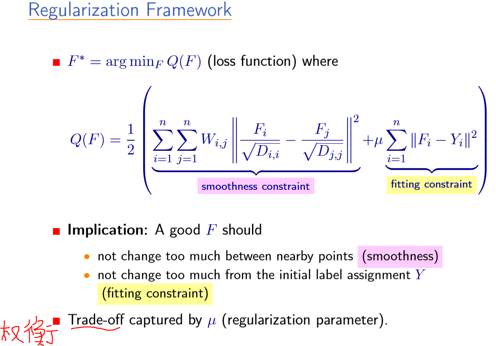

### LLGC

论文：[Learning with Local and Global Consistency](../papers/LGC.pdf)

- [networkx 实现](https://networkx.github.io/documentation/stable/reference/algorithms/generated/networkx.algorithms.node_classification.lgc.local_and_global_consistency.html)
- [sklearn 实现](http://sklearn.apachecn.org/#/docs/15)
- [sklearn 实现](https://scikit-learn.org/stable/modules/label_propagation.html)
- [LLGC 简单实现](lgc.ipynb)

### LLGC 解读

参考 [Wittawat Jitkrittum 解读](https://pdfs.semanticscholar.org/1a55/01b537d94178c723ee475a59e3345e9e89c8.pdf)

- L: 靠近的数据点可能有相同的标签, 即 Local
- G: 有相同结构的的数据点可能有相同的标签, 即 Global
- C: 让每个点 iteratively spread 其标签信息到其临近, 直到实现全局稳定, 即 Consistency

#### 1. Transduction

- Input: $\{x_i,y_i\}_{i=1}^{l}$ 和 $\{x_i\}_{i=l+1}^{l+u}$
    - $l \ll u$
    - $n = l + u$
    - $y_i \in \{0,\cdots, C-1\}$ (分类任务)
    - 无需借助映射 $f: X \mapsto Y$, 便可推断 $\{y_i\}_{i=l+1}^{l+u}$
- 优势：比  Induction 更简单，因为无需映射 $f$, 仅仅做标签传播即可

#### 2. Set Up

2.1 对于每个 $x_i$ 定义：

$$
Y_i := (\delta (y_i = 1),\cdots,\delta(y_i = C)) \in \{0,1\}^{1 \times C}
$$

若 $x_i$ 无标签比如, $i \geq  l + 1$, 则 $Y_i = \mathbf{0}_{1 \times C}$.

2.2 对于每个 $x_i$, 通过 label propagation 来找到一个非负评分向量(nonnegative scoring vector) $F_i \in \mathbb{R}_{+}^{1 \times C}$, 即 $F_i = (f_{i1},\cdots,f_{iC})$.

2.3 目标: 通过固定的 $Y$ 来求得 $F$. 其中

$$
Y = \begin{pmatrix}
Y_1\\ \vdots \\ Y_{l+u}
\end{pmatrix};
F = \begin{pmatrix}
F_1\\ \vdots \\ F_{l+u}
\end{pmatrix}
$$

#### 3 Label Propagation Algorithm

- $W \in \mathbb{R}^{n \times n}$, 且 $W_{ii} = 0$.
- 标准化 $W$ 为

$$
S = D^{-\frac{1}{2}} W D^{-\frac{1}{2}}
$$

其中 $D$ 为对角矩阵, 且 $D_{ii} = \sum_{j}W_{ij}$.

- 迭代过程

$$
F(t + 1) \leftarrow \alpha SF(t) + (1 − \alpha)Y
$$

这里 $\alpha \in (0,1)$, 且 $F(0) = Y$

- 计算 $x_i$ 的标签

$$
y_i = \arg\max_k
F^∗_{ik}
$$

这里 $F^∗ := \displaystyle\lim_{t \to \infty} F(t)$.

#### 4 相似度矩阵

1. $\epsilon$-neighborhoods

$$
W_{ij} = 1 \text{ if } ||x_i − x_j|| < \epsilon
$$

May lead to several connected components.

2. $k$ nearest neighbors (kNN)

$$
W_{ij} = 1 \text{ if } x_i \in \text{ kNN}(x_j) \text{ or } x_j \in \text{ kNN}(x_i)
$$

3. Gaussian kernel:

$$
W_{ij} = \exp(− \frac{||x_i − x_j||^2}{2\sigma^2})
$$

#### 5 注意事项

- [ ] $W$ 捕获了数据的固有结构
- [ ] 设置 $W_{ij} = 0$ 以避免自我强化(self-reinforcement)
- [ ] $\alpha$ 从近邻和 $Y$ 中权衡信息(High $\alpha \Rightarrow$ trust neighbors ($\alpha = 0.99$ in the paper))

$$
F(t + 1) \leftarrow \alpha SF(t) + (1 − \alpha)Y
$$

- [ ] Analytic update(依赖于 $F(0)$)

$$
F^∗ = (1 − \alpha)(I_{n\times n} − \alpha S)^{−1} Y
$$

#### 算法推导

原始数据由有标签数据 $\{x_i,y_i\}_{i=1}^{l}$ 和无标签数据 $\{x_i\}_{i=l+1}^{l+u}$ 组成. 其中

- $x_i$ 可以是图片的像素级特征(一般分为灰度图和彩色图片)或者文本数据;
- $y_i \in \{0, \ldots, C-1\}$ ($C$ 为 $x_i$ 所属类别的个数);
- $l \ll u$

对于任意的特征 $x_i$, 通过特征提取器 $f$ 提取其语义特征向量为 $X_i = f(x_i)$, 且记

$$
X = \begin{pmatrix}
X_1\\ \vdots \\ X_{l+u}
\end{pmatrix}.
$$

下面便可以通过 $X_1,\ldots, X_n$ 来计算原始数据集的相似度矩阵 $W$, 记 $d_i = \sum_j (W)_{ij}$, 则有 $D = \text{diag}\{d_1, \ldots, d_n\}$ 和 $\Delta = D-W$. 为了利用向量化编程来提高算法的运算效率, 还需要将 $y_i$ 向量化:

$$
(Y_i)_j = \begin{cases}
1 & j = y_i \text{ and } i \leq l\\
0 & 其他
\end{cases}
$$

这样, 便可定义

$$
Y = \begin{pmatrix}
Y_1\\ \vdots \\ Y_{l+u}
\end{pmatrix}.
$$

定义 $F \in \mathbb{R}^{n\times C}$ 满足

$$
y_i = \arg\max_j \; (F_i)_j
$$

LGC 的目标是最小化能量函数

$$
\begin{aligned}
Q(F) &= \frac{1}{2} {\displaystyle\sum_{i=1}^{n}\sum_{j=1}^n (W)_{ij} ||\frac{F_i}{\sqrt{(D)_{ii}}} - \frac{F_j}{\sqrt{(D)_{jj}}}||^2} + \mu \sum_i ||F_i-Y_i||^2\\
&= \text{tr} (F^T (I − S)F)+ \mu (\text{tr} (F^T F)− 2\text{tr}(F^TY)+ \text{tr}(Y^TY))
\end{aligned}
$$

其中 $\mu >0$ 用来权衡 `L` 与 `G`, 且

$$
S = D^{-\frac{1}{2}} W D^{-\frac{1}{2}}
$$

由 $\frac{\partial E(F)}{\partial F} = 0$, 可得 $(I − S)F + \mu (F − Y ) = 0$, 即可得迭代方程

$$
F(t+1)= \alpha SF(t) + (1-\alpha) Y
$$

其中 $\alpha = \frac{1}{\mu + 1}$. 故而 $0<\alpha<1$, 由 $F(0)=Y$, 可得

$$
F(t+1) = (\alpha S)^{t+1}Y + (1-\alpha) \sum_{i=0}^{t} (\alpha S)^i Y
$$

$t\to \infty$ 可得

$$
F^* = (1-\alpha)(I-\alpha S)^{-1}Y
$$

### sklearn 算法实现 lgc

详细内容见：[标签传播算法(llgc 或 lgc)](https://www.cnblogs.com/q735613050/p/10402835.html).

在 [sklearn 实现](https://scikit-learn.org/stable/modules/label_propagation.html) 中提供了两种不同 lgc 模型: `LabelPropagation` 和 `LabelSpreading`, 其中后者是前者的正则化形式. 相似度矩阵 $W$ 的计算方式提供了 `rbf` 与 `knn`.

- `rbf` 核由参数 `gamma`控制（$\gamma=\frac{1}{2{\sigma}^2}$）
- `knn` 核 由参数 `n_neighbors`（近邻数）控制
